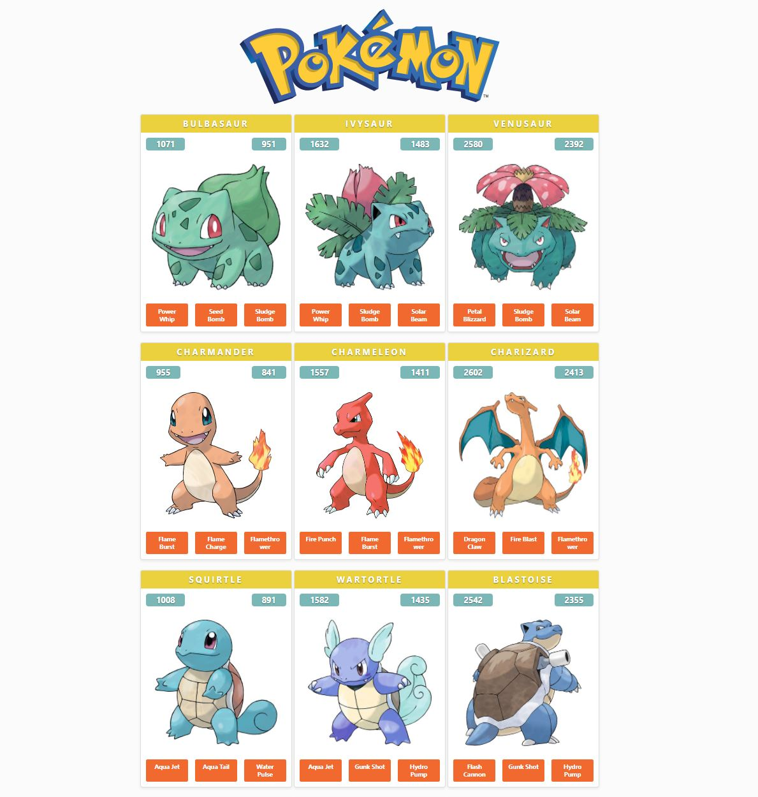

# pokemon-app



Web app providing an overview of the 151 original Pokemon!

Using:

- [React.js](https://reactjs.org/),
- [GraphQL](https://graphql.org/),
- [Node.js](https://nodejs.org/),
- [Webpack](https://webpack.js.org/),
- [Babel.js](https://sqitch.org/),
- [The Pokemon API](https://graphql-pokemon2.vercel.app/)

## Getting Started

1. Clone the repo using `git clone`.
2. Launch:

```bash
npm install
npm run start
```

3. Enjoy! :rocket: